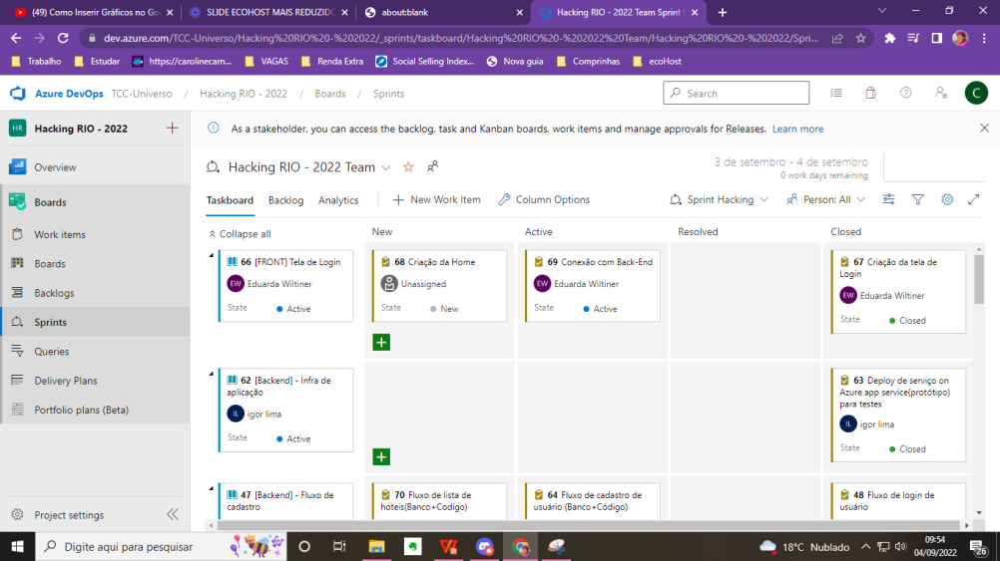

# Projeto do time LIBRA/32, *Desafio Hurb -  Hackin.Rio 2022*

## Boas-vindas ao repositório do EcoHost - parte de Front-End

Esse desafio foi proposto pela empresa Hurb e o problema cetral a ser reolvido é a "Emissão de carbono provocado pelo alto gasto de energia de Hotéis". A solução que propomos é uma plataforma de monitoramento de consumo de CO2 de hotéis e pousadas de médio e grande porte, que permita mapear hábitos de consumo de hóspedes e funcionários de modo a entender o comportamento do público e permitir elaborar soluções que tornem o negócio mais sustentável e inteligente. 

Para a solução completa foi entregue um [Design](https://www.figma.com/file/lvi4bRgLUf50g6he36891R/Hacking.Rio---2022?node-id=0%3A1) para servir de guia na programação da aplicação. A aplicação EcoHost hospedada pode ser acessada a partir desse [link](https://hacking-rio-2022.vercel.app/login), só atentando para acessar em um computador pois a plataforma não é responsiva. Se desejar ver a aplicação funcionando em um breve vídeo, você pode assistir [aqui](https://youtu.be/GvWNm6gEj24), mas logo abaixo disponibilizamos algumas imagens para mostrar a aplicação. Além do Back-End para cadastro e autenticação do usuário, mais detalhes [aqui](https://github.com/hackingrio/hackingrio-2022-ods-7-desafio-hurb-libra-34/tree/develop).
### As ferramentas principais utilizadas no front-end foram:

[React](https://reactjs.org/)<br>
[Minimal UI Kit](https://github.com/minimal-ui-kit/material-kit-react/)<br>
[Git](https://git-scm.com/)<br>
[ESLint](https://eslint.org/)<br>
[MUI](https://mui.com/pt/)<br>
[Styled Components](https://www.styled-components.com/)<br>
[Joitai](https://jotai.org/)<br>
[Vercel](https://vercel.com/)<br>

### Funcionalidades
- Efetuação de cadastro;
- Acesso através da página de login;
- Interação com o Dashboard com métricas;
- Visualização do conteole de Acesso dos Usuários; 
- Revisão do acesso errado a URL - Página 404:

---

## Sumário

- [Organização do Projeto](#organização-do-projeto)
- [Desenvolvimento do Back-End](#desenvolvimento-do-back-end)
- [Como Instalar e rodar a aplicação localmente](#como-instalar-e-rodar-a-aplicação-localmente)
- [Link para o deploy da Plataforma](#link-para-o-deploy-da-plataforma)
- [Informação Importante](#imformação-importante)

---

## Organização do projeto:

O projeto foi feito seguindo o Kanban, que pode ser visto como um processo ágil e transparente na organização dos projetos de desenvolvimento e foi muito útil para o time no fluxo de trabalho e na divisão de tarefas. Você pode visualizar o Kanban que a equipe utilizou no Azure neste [link](https://t).

<div align="center">
  
</div>

## Desenvolvimento do Back-End:

A parte de autenticação do usuário, registro e atualização da senha, era uma parte opcional do projeto. A equipe optou por criar uma API do zero feita em Java. Ficou responsável por uma única pessoa, a Eduarda Wiltiner, já que ela demonstrou interesse em demonstrar as habilidades full-stack. O respositório e as ferramentas utilizadas para a criação do processo de autenticação do usuário através de uma API Java está registrado no repositório [API Auth Java](https://github.com/dudawiltiner/api-auth-java). A documentação da API tbm pode ser acessada [aqui](https://api-auth-java.herokuapp.com/swagger-ui.html) para mais detalhes.

## Como Instalar e rodar a aplicação localmente:

### 1. Clone do repositório

Após cada um dos passos a seguir, haverá um exemplo do comando a ser digitado para fazer o que está sendo pedido.

1.1. Abra o terminal e crie um diretório no local de sua preferência:
**mkdir** ecohost-project:

```javascript
  mkdir ecohost-project
```

1.2. Entre no diretório que acabou de criar e depois clone o projeto:

```javascript
  cd pokemon-project
  git clone https://github.com/hackingrio/hackingrio-2022-ods-7-desafio-hurb-libra-34.git
```
### 2. Instalação da dependências

2.1. Entre no diretório criado após a clonagem do repositório.

```javascript
  cd hackingrio-2022-ods-7-desafio-hurb-libra-34
```

2.2. Instale todas as dependências usando o CLI npm:

```javascript
  npm install
```

### 3. Inicie a aplicação

3.1. Abra no ambiente de desenvolvimento de sua preferência. No caso de uso do VSC, digite o comando **code .** na raiz do diretório clonado.

```javascript
  code .
```
3.2. Rode a aplicação com o node.js, usando o CLI **npm**.

```javascript
  npm start
```
-> Uma janela irá abrir no seu navegador da EcoHost

**OBS**: **Certifique-se** de usar umas dessas **urls("http://localhost:3000", "http://localhost:3001", "http://localhost:8080")** para poder ter acesso a API de autenticação durante o uso da aplicação, fazendo com que tudo ocorra bem.

## Informação Importante:

O nosso time, em pró da economia de tempo, usou um template minimalista para criação do Dashboard, baseado na mesma biblioteca de CSS MUI para o React e houve adaptações de código para conseguir entregar o discutirmos no início. Dando os devidos créditos ao criador ou criadora do templare [Minimal UI Kit](https://github.com/minimal-ui-kit/material-kit-react).

## Link para o deploy da plataforma:
https://hacking-rio-2022.vercel.app/login


